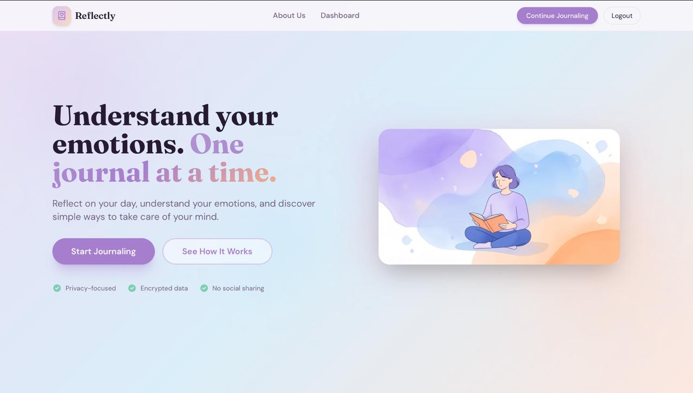
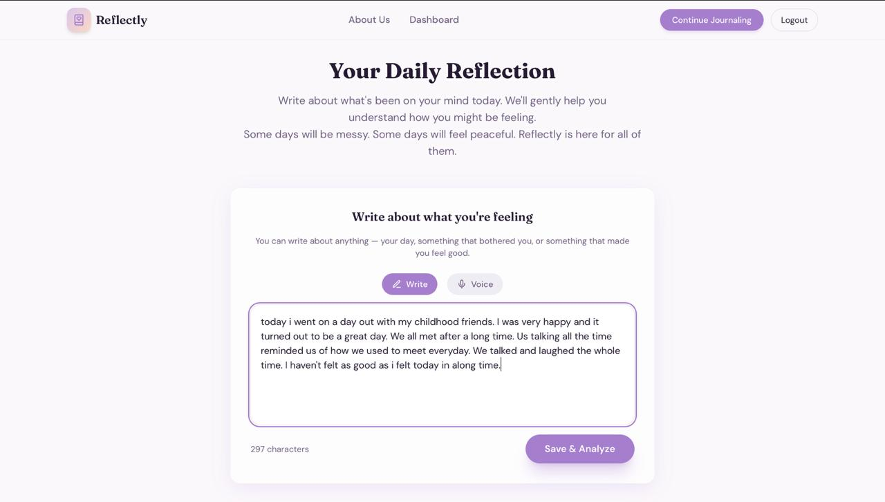
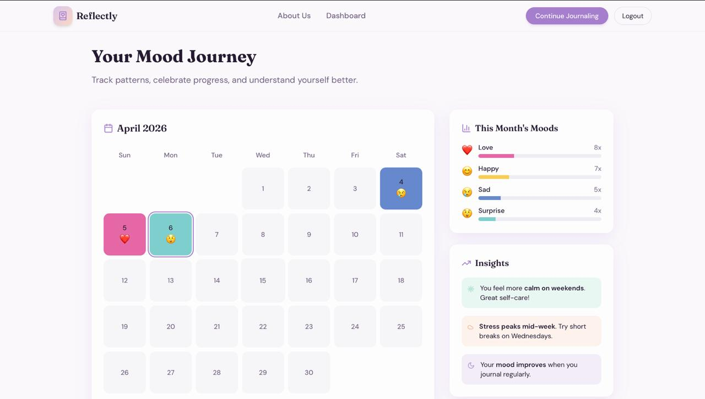
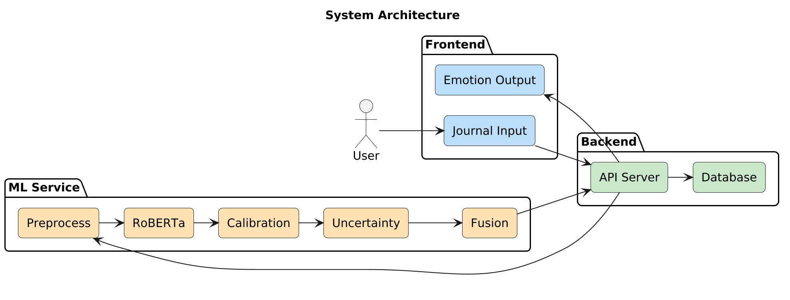

# 🌸 Reflectly

**Emotion-aware journaling, powered by calibrated deep learning.**

*Write freely. Understand yourself better.* ✨

---

## 🧠 Overview

Reflectly is a full-stack journaling application that understands the emotional tone of your writing. It combines a fine-tuned RoBERTa model with uncertainty estimation and lexicon-based fusion to classify emotions in journal entries across six categories, then surfaces those insights through mood tracking and visual analytics.

The goal is not to label your feelings, but to help you notice patterns over time, gently and accurately. 🌿

---

## ✨ Features

- **Emotion Classification** 🧠 - Fine-tuned RoBERTa model across 6 emotion classes  
- **Calibrated Confidence** 🎯 - Temperature scaling ensures probability outputs are meaningful  
- **Uncertainty Estimation** 📊 - MSP and entropy signals flag low-confidence predictions  
- **Hybrid Fusion** 🌼 - NRCLex lexicon enriches model predictions conditionally  
- **Mood Journey** 📅 - Visual timeline of emotional states across entries  
- **Insights Dashboard** 📈 - Aggregated trends and emotion distribution over time  
- **Secure Journaling** 🔒 - Private entries with user authentication via JWT  
- **Responsive UI** 💻 - Clean React interface built for reflection, not distraction  

---

## 🖼️ Application Preview

### 🏠 Landing Page

### ✍️ Journal Entry
![Journal Entry])

### 📊 Mood Journey
![Mood Journey]

## 🏗️ System Architecture

![System Architecture]

The system separates concerns across three layers:

- **Frontend** 🎨 - React SPA handles journaling, mood visualization, and user interaction  
- **Backend** ⚙️ - Node.js + Express manages auth, user data, and journal persistence via MongoDB  
- **ML Service** 🤖 - FastAPI microservice runs inference, calibration, and uncertainty logic independently  

The backend proxies ML requests, keeping the inference service decoupled and independently scalable.

---

## ⚙️ Tech Stack

| Layer | Technology | Purpose |
|---|---|---|
| Frontend | React, Recharts | UI, mood visualizations |
| Backend | Node.js, Express | REST API, business logic |
| Database | MongoDB, Mongoose | User data, journal storage |
| Auth | JWT, bcrypt | Secure session management |
| ML Service | FastAPI, Uvicorn | Inference microservice |
| Model | RoBERTa (HuggingFace) | Emotion classification |
| Calibration | Temperature Scaling | Post-hoc probability calibration |
| Lexicon | NRCLex | Emotion-word hybrid fusion |
| ML Libraries | PyTorch, Transformers, scikit-learn | Model training and evaluation |

---

## 🧠 Model Details

| Component | Detail |
|---|---|
| Base Model | `roberta-base` (HuggingFace) |
| Task | Multi-class emotion classification |
| Classes | Joy, Sadness, Anger, Fear, Surprise, Disgust |
| Calibration | Temperature scaling (post-hoc) |
| Uncertainty | Maximum Softmax Probability (MSP) + Entropy |
| Fusion | Conditional NRCLex integration on low-confidence inputs |
| Serving | FastAPI + Uvicorn |
| Input | Raw journal text (tokenized, max 512 tokens) |

---

## 🔍 How It Works

✨ Click to expand the full pipeline

**1. Entry Submission**  
The user writes a journal entry in the React frontend. On save, the text is sent to the Node.js backend.

**2. ML Inference**  
The backend forwards the text to the FastAPI ML service. RoBERTa tokenizes and encodes the input, producing raw logits across 6 emotion classes.

**3. Calibration**  
Temperature scaling is applied to the logits before softmax, correcting overconfidence that is common in fine-tuned transformers.

**4. Uncertainty Estimation**  
Two uncertainty signals are computed:  
- **MSP (Maximum Softmax Probability)** - Low peak probability indicates uncertainty  
- **Entropy** - High entropy across the distribution signals ambiguity  

**5. Hybrid Fusion**  
If uncertainty exceeds a threshold, NRCLex lexicon scores are blended into the prediction. This grounds ambiguous model outputs in word-level emotion signals.

**6. Storage and Display**  
The final emotion label and confidence are stored with the journal entry. The frontend renders the result inline and updates the mood journey and insights views.

---

## 📁 Project Structure
